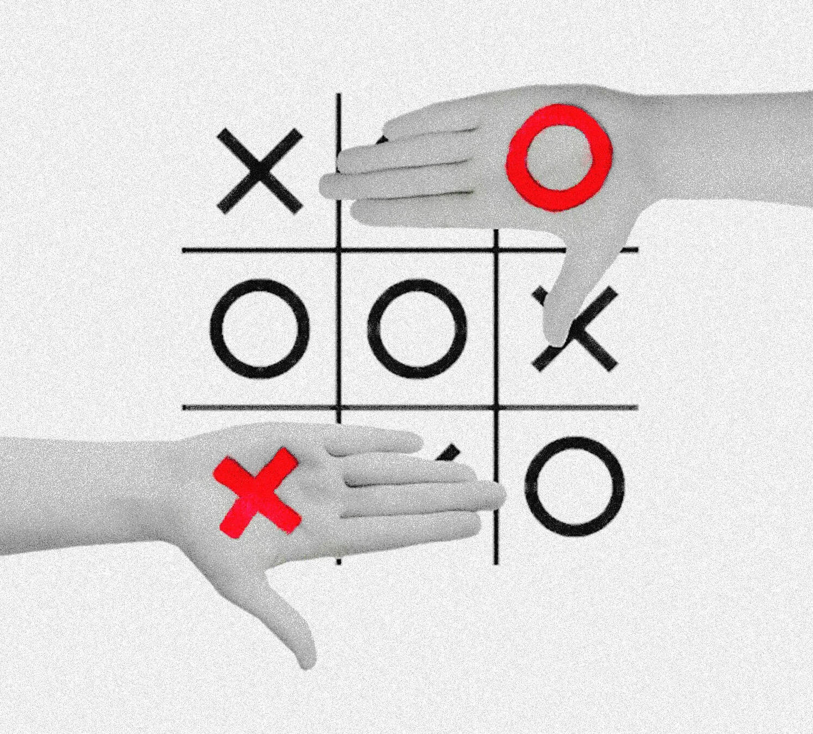
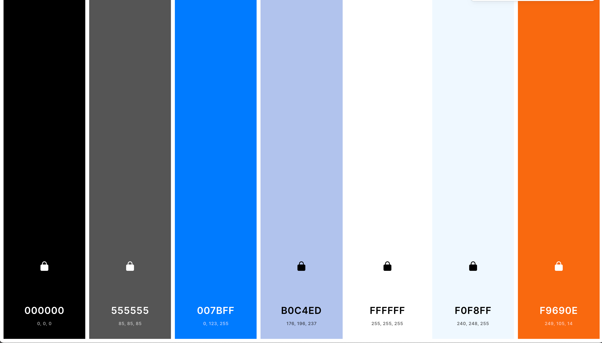
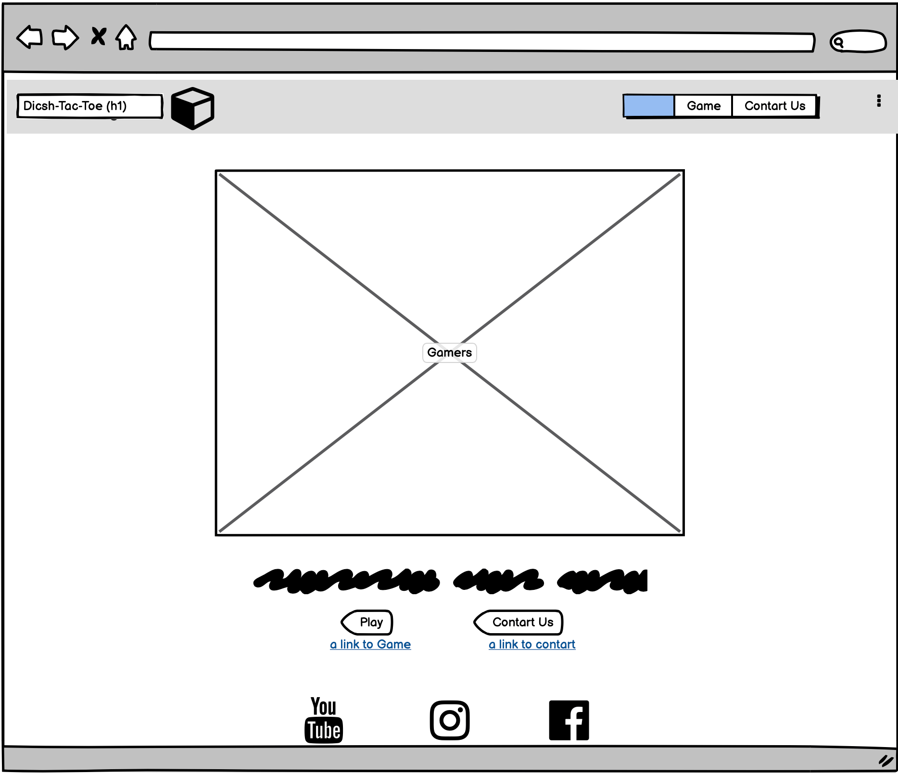
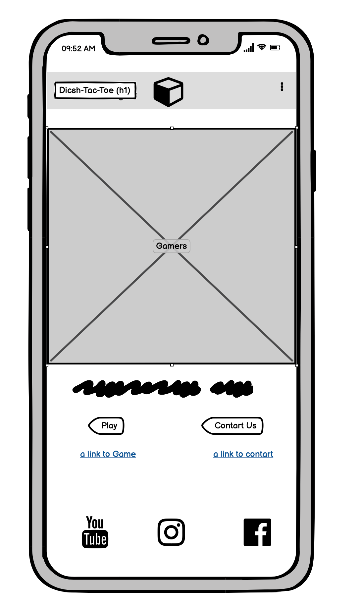

[](https://gitpod.io/#https://github.com/Spotarachy/M2-game-time)


## ```WH0 WILL IT BE!```



https://spotarachy.github.io/M2-game-time/index.html


---

```
About
```

/* This will be my Milston M2 projcet, i've made this game to help Couples and roommates finally solve the problem odf who's turn is it to wash thee dishes, by Mario F Wilson, lets see how it's made, injoy. */


## TABLE OF CONTENTS 

[UX - User Experience](#ux)
   * [Project Goals](#project-goals)
   * [User Stories](#user-stories)

     1. Visitiing the site for the fist time

     2. Returning Visitor to the site

     3. Frequent User to the site

[Design](#design-choices)

   * [Colours](#colours)
     1. Primary colours listening.

     2. Secondary colour listening.

     3. Full colour graph.

   * [Typography](#typography)

     1. Open Sans            

     2. Arial Narrow Bold sans-serif

     3. Georgia, 'Times New Roman'

   * [Images](#images)

     1. Pexels

   * [Icons](#icons)
   * [Layout](#layout)
   * [Wireframes](#wireframes)

     1. Website 

     2. Mobile 

  * [Features](#Features)
  * [Validator](#validator)
  * [Testing](#Testing)
  * [Further-teseting](#Further-testing)

     1. index.html

     2. desktop

     3. perfromace 

  * [Konws-bugs](#Konws-bugs)

  [Developmnet](#Developmnet)

   * [GithubPage](#Github Page)
   * [Credit](#Credit)

      1. Image credit

      2. Colour credit
      
   * [Acknowledgements](#Acknowledgement)


---

```
UX - User experience
```


At Dicsh Tac Toe we aim to have the most enjoyable time when it comes to establishing peacs in your life, by helping are visitors to find out who's turn is it to wash the dish?

By giving out visitors a fun way to interact and to play games, best out of three win's, and will hopefully get you on the right track to being a happy couple after she beat you,and the Dicsh has been cleared.

# PROJECT GOALS 

   1. To help and provide an easy way to solve problme.
   2. To give are uses a plces where they can come to an agreement.
   3. To prvide a experience!
   4. Get the harmony back plus bragging rights.
   5. To have fun!


# USER STORIES

*  ## Visitting 1st time: 

   6. How fast is the website loading.
   7. Is the website easy to understand.
   8. Does it have quick responses.
   9. How's the design.
   10. How involved with the design with the end user in mine.
   11. All the link should work.
   12. Easy to navigate.
   13. Not confusing.
   14. Simply. 
   15. Interactive.


* ## Returning visitor:

   16. I wanna see my top score for my last visit.
   17. Will the website remember my username. 
   18. It's simplify the way we wash dishes.
   19. Easy way to stop argument.
   20. It made us laugh.
   21. They gave us a jolly old time alright!
   22. Will keep coming back to see if more games has been   added.

  
* ## Frequent Users :


   23. To see how the site has developed from the first time we have been invited to it.
   24. Enjoy the interaction. 
   25. Like to see all the new scores and new people using the website.
   26. Been able to keep track of their wins.
   27. Want to keep update wiht stories from other users.
   28. Wanna be able to link my Facebook to this game.
   29. Kept in the loop of updates to the website or if the site is gonna go down.
   

* ## Site Ower Goal:

   30. As site owner, I want to give people back time to spend together.
   31. As site owner, I wanted to be easy to navigate and very responsive.
   32. To make this website a hit & implement more minn games.
   33. To be able to build on a platform created and expanded.
   34. Find ways to better innovate the website into apps.
   35. Have an interchange of encouragement you are users.


---

```
Designs
```

For the design of this webpage we went for a fairly simple design of tic-tac-toe then incorporated  our simple style to fulfil the players & our clients wishes for the design and the functionality of this page and game.


## COLOURS 

The colours of implementing for this website our from two earth are favourite websites for choosing a precise RGB colours.

* Primary colours use, for over all look and feel of the pages we're:

    1. #B0C4ED rgb (176,196,237) 
    [Click Me](https://www.color-hex.com/color/b0c4ed)

    2. #FOF8FF rgb (240,248,255)
    [Click Me](https://www.color-hex.com/color/f0f8ff)

    3. #FFFFFF rgb  (255,255,255) 
    [Click Me](https://www.color-hex.com/color/ffffff)

    4. #000000  rgb  ( 0 , 0 ,  0  )
    [Click Me](https://www.color-hex.com/color/000000)
    
* Secondary colours use, for the overall look and style our:

   5. #555555 rgb (85 ,85 ,85) [Click Me](https://www.color-hex.com/color/555555)

   6. #007BFF rgb (0, 123, 255)[Click Me](https://www.color-hex.com/color/007bff)

   7. #F9690E rgb (249 ,105,14)[Click Me](https://www.color-hex.com/color/f9690e)


* Full colour graph:



Credit for use of the website will be in the acknowledgement section of this README.md


## TYPOGRAPHY 

1. The main font that is going to be use is Open Sans,
   Light 300 italic, this font is going be uesd through the whole website, this font came form Google fonts.

   * Why Open Sans:
      [Google fonts](https://fonts.google.com/specimen/Open+Sans#about)
   
   * Designerd by: Matteson Typographics.
      [Type Design & Consulting](https://mattesontypographics.com/)
  

2. The secondary fonts for (h2) that was used was :vArial Narrow Bold sans-serif, Font was generated straight from the CSS3 browser! 
No can be provided..

   * Why Arial Narrow Bold  sans-serif: 
      was used to add symmetry to the website!

      For Visual Example of Font:[Arial](https://www.cssfontstack.com/Arial-Narrow)


3. The territory fonts for (h3) that was used wa: Georgia, 'Times New Roman', Times, serif, Font was generated straight from the CSS3 browser! No can be provided..

   * Why Georgia, 'Times New Roman', Times, serif:
      was uesd to add a different feel to the headers!

      For Visual Example of Font:[Georgia](https://www.cssfontstack.com/Georgia)
      


## IMAGES 

All my images are high-quality 4K images that was sauce from pixels website through my account which are free for public use.

* Images will be Source for [Pexels](https://www.pexels.com/search/Tic%20tac%20toe/) 
For Free to uesd images from [my account](https://www.pexels.com/@mario-f-wilson-58865816).

Please follow this link to see all images [Imageas](https://github.com/Spotarachy/M2-game-time/tree/master/assets/image)


Note: Not all for those images present were added to this project!

## ICONS 

All items provided came from across the websites such as bootstraps and font awesome.

* Social Media were sourced form [Font Awesome](https://fontawesome.com) and [Google Fonts](https://fonts.google.com/icons)

* Other icons resource from [Bootstrap](https://getbootstrap.com/docs/4.0/extend/icons/)

## WIREFRAMS 

Wirefram was maed with me and we'll balsamiq:

1.** WebSite:**


2.** Moblie:**


---
``` 
Features
```

---
## VALIDATORS 

 These are validating websites that are used to validate my website properly.

   * HTML Validator 
   [HTML Validaton](https://jsonformatter.org/html-validator)

   * W3C Markup Validation Service:
   [W3C Validation](https://validator.w3.org/#validate_by_input)

   * Css Validation Service:
   [CSS Validation](https://jigsaw.w3.org/css-validator/#validate_by_input)


## TESTING 

   * Performance: 
   [google developers](https://developers.google.com/web/tools/lighthouse)

   * Accessibility: 
   [Wave](https://wave.webaim.org/)

   * Ued for all the js code errors in my code:
   [JS Code](https://jshint.com/)
   
   * JSHint, a tool that helps to detect errors and potential problems in your JavaScript code."
   [JS Hint](https://validator.w3.org)

   
    


## KONWN BUGS 

Near several known bugs in the course of making this website, I will link a code to the source code.

[Konwn Bugs](https://github.com/Spotarachy/M2-game-time/blob/master/None.Bugs.html)
 
---
```
Developmnet
```


## GITHUB 

Webpage will be deployed form GitHub:

https://spotarachy.github.io/M2-game-time/index.html


## CREDIT


### Image Credit

Would like to give credit to:

Pexels operates the website www.pexels.com ("Website"), a platform that allows you to post, link, store, share and otherwise make available certain information, text, graphics, photos, videos, or other material (together "Content"). Our goal is to help designers, bloggers and everyone who is looking for an image to find photos and other Content that you can use for free subject to and in compliance with these Terms.

(Note! Phrase from original website)
* Web page
[Pexels](https://www.pexels.com/)


### Colour Credit 

Would like to give credit to:

Color-hex gives information about colors including color models (RGB,HSL,HSV and CMYK), Triadic colors, monochromatic colors and analogous colors calculated in color page. also generates a simple css code for the selected color. Html element samples are also shown below the color detail page. 

(Note! Phrase from original website)
* Web page
[Color-hex](https://www.color-hex.com/)
* Terms of Services
[Color-hex](https://www.color-hex.com/privacy.php)


Would like to give credit to:

 Coulors website for accurate RGB colours all the time free to use to each users with the same I have added a link to their search terms and conditions.

* Web page
[Coolors](https://coolors.co/)
* Terms of Services
[Coolors](https://coolors.co/terms-of-service)

## ACKONWLEDGEMENTS 


I must Acknowledge tinyPNG is a really cool website to make your photos smaller.

[Tinypng](https://tinypng.com/)


