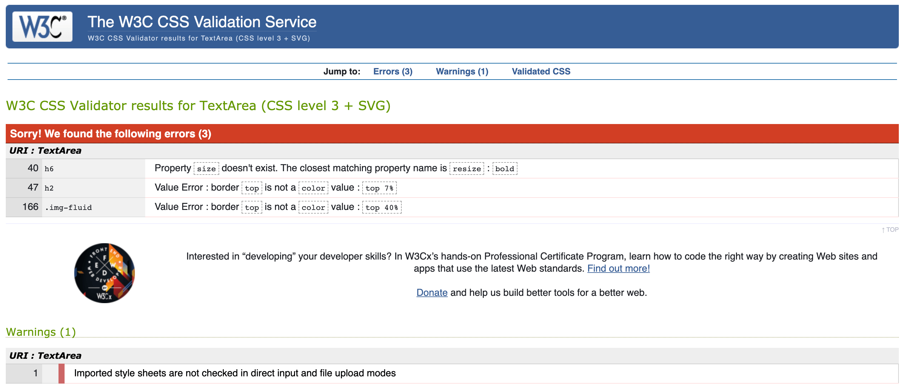

[](https://gitpod.io/#https://github.com/Spotarachy/M2-game-time)


## ```WH0 WILL IT BE!```


https://spotarachy.github.io/M2-game-time/

http://spotarachy.github.io/M2-game-time/index.html


---

```
About
```

/* This will be my Milestone M2 project, i've made this game to help Couples and roommates finally solve the problem of who's turn it is to wash these dishes, by Mario F Wilson, lets see how it's made, enjoy. */


## TABLE OF CONTENTS 

[UX - User Experience](#ux)
   * [Project Goals](#project-goals)
   * [User Stories](#user-stories)

     1. Visiting the site for the fist time

     2. Returning Visitor to the site

     3. Frequent User to the site

[Design](#design-choices)

   * [Colours](#colours)
     1. Primary colours listening.

     2. Secondary colour listening.

     3. Full colour graph.

   * [Typography](#typography)

     1. Open Sans            

     2. Arial Narrow Bold sans-serif

     3. Georgia, 'Times New Roman'

   * [Images](#images)

     1. Pexels

   * [Icons](#icons)
   * [Layout](#layout)
   * [Wireframe](#wireframes)

     1. Website 

     2. Mobile 

  * [Features](#Features)
  * [Validator](#validator)
  * [Testing](#Testing)
  * [Further-testing](#Further-testing)

     1. index.html

     2. desktop

     3. performance

  * [Known-bugs](#Known-bugs)

  [Development](#Development)

   * [GithubPage](#Github Page)
   * [Credit](#Credit)

      1. Image credit

      2. Colour credit
      
   * [Acknowledgements](#Acknowledgement)

---

```
UX - User experience
```

At Dish Tac Toe we aim to have the most enjoyable time when it comes to establishing peace in your life, by helping our visitors to find out who's turn it is to wash the dishes?

By giving our visitors a fun way to interact and to play games, best out of three win's, and will hopefully get you on the right track to being a happy couple after she wins, and the Dishes has been cleaned.

# PROJECT GOALS 

   1. To help and provide an easy way to solve problem.
   2. To give our uses a places where they can come to an agreement.
   3. To provide a experience!
   4. Get the harmony back plus bragging rights.
   5. To have fun!


# USER STORIES

*  ## Visiting 1st time: 

   6. How fast is the website loading.
   7. Is the website easy to understand.
   8. Does it have quick responses.
   9. How's the design.
   10. All the links should work.
   11. Easy to navigate.
   12. Not confusing.
   13. Simple. 
   14. Interactive.


* ## Returning visitor:

   15. I want to see my score of wins. 
   16. It's simplifies the way we decide who is going to wash the dishes.
   18. Easy way to stop an argument.
   19. It made us laugh.
   20. Will keep coming back to see if more games has been added.

  
* ## Frequent Users :

   21. Want to be able to link my Facebook to this game.
   22. Want to ask questions to the developer of the website or if the site is gonna go down.
   

* ## Site Owner Goal:

   23. As site owner, I want to give people back time to spend together.
   24. As site owner, I wanted it to be easy to navigate.
   25. To make this website a hit and implement more mind games.
   26. Find ways to better innovate the website into apps.
   27. Have an interchange of encouragement you our users.


---

```
Designs
```

For the design of this webpage we went for a fairly simple design of tic-tac-toe then incorporated  our simple style to fulfil the players and our clients wishes for the design and the functionality of this page and game.


## COLOURS 

The colours used for this website are from two different types of websites for choosing a precise RGB colours.

* Primary colours use, for over all look and feel of the pages were:

    1. #B0C4ED rgb (176,196,237) 
    [Click Me](https://www.color-hex.com/color/b0c4ed)

    2. #FOF8FF rgb (240,248,255)
    [Click Me](https://www.color-hex.com/color/f0f8ff)

    3. #FFFFFF rgb  (255,255,255) 
    [Click Me](https://www.color-hex.com/color/ffffff)

    4. #000000  rgb  ( 0 , 0 ,  0  )
    [Click Me](https://www.color-hex.com/color/000000)
    
* Secondary colours used, for the overall look and style are:

   5. #555555 rgb (85 ,85 ,85) [Click Me](https://www.color-hex.com/color/555555)

   6. #007BFF rgb (0, 123, 255)[Click Me](https://www.color-hex.com/color/007bff)

   7. #F9690E rgb (249 ,105,14)[Click Me](https://www.color-hex.com/color/f9690e)


* Full colours graph:


Credit for use of the website will be in the acknowledgement section of this README.md


## TYPOGRAPHY 

1. The main font that is going to be used is Open Sans,
   Light 300 italic, this font is going be used throughout the whole website, this font came from Google fonts.

   * Why Open Sans:
      [Google fonts](https://fonts.google.com/specimen/Open+Sans#about)
   
   * Designed by: Matteson Typographics.
      [Type Design & Consulting](https://mattesontypographics.com/)
  

2. The secondary fonts for (h2) that were used were: Arial Narrow Bold sans-serif, Font was generated straight from the CSS3 browser! 
None can be provided..

   * Why Arial Narrow Bold  sans-serif: 
      were used to add symmetry to the website!

      For Visual Example of Font:[Arial](https://www.cssfontstack.com/Arial-Narrow)


3. The territory fonts for (h3) that were used are: Georgia, 'Times New Roman', Times, serif, Font was generated straight from the CSS3 browser! None can be provided..

   * Why Georgia, 'Times New Roman', Times, serif:
      was used to add a different feel to the headers!

      For Visual Example of Font:[Georgia](https://www.cssfontstack.com/Georgia)
      

## IMAGES 

All my images are high-quality 4K images that were sourced from pixels website through my account which were free for the public to use.

* Images will be Sourced from [Pexels](https://www.pexels.com/search/Tic%20tac%20toe/) 
For Free to used images from [my account](https://www.pexels.com/@mario-f-wilson-58865816).

Please follow this link to see all images [Images](https://github.com/Spotarachy/M2-game-time/tree/master/assets/image)


Note: Not all for the images present were added to this project!

## ICONS 

All items provided came from across the websites such as bootstraps and font awesome.

* Social Media were sourced from [Font Awesome](https://fontawesome.com) and [Google Fonts](https://fonts.google.com/icons)

* Other icons were sourced from [Bootstrap](https://getbootstrap.com/docs/4.0/extend/icons/)

## WIREFRAMS 

Wireframs was made by balsamiq:

1.** WebSite:**


2.** Mobile:**

---
``` 
Features
```

## VALIDATORS 

 These are validating websites that were used to validate my website properly.

   * HTML Validator
   [Example](/Bugs/testing/test/index.png)

   
   * HTML Validator
   [Example](/Bugs/testing/test/game.png)

   * HTML Validator
   [Example](/Bugs/testing/test/contact.png)

   * CSS Validator
   [Example](/Bugs/testing/test/test.CSS.png)

   * HTML Validator 
   [HTML Validation](https://jsonformatter.org/html-validator)

   * W3C Markup Validation Service:
   [W3C Validation](https://validator.w3.org/#validate_by_input)

   * Css Validation Service:
   [CSS Validation](https://jigsaw.w3.org/css-validator/#validate_by_input)


## TESTING 

   * Performance: 
   [google developers](https://developers.google.com/web/tools/lighthouse)

   * Accessibility: 
   [Wave](https://wave.webaim.org/)

   * Used for all the js code errors in my code:
   [JS Code](https://jshint.com/)
   
   * JSHint, a tool that helps to detect errors and potential problems in your JavaScript code."

   [JS Hint](https://validator.w3.org)

   

   
    

## KNOWN BUGS 

Aware of several known bugs in the course of making this website, I will link a code to the source code.

[Known Bugs](https://github.com/Spotarachy/M2-game-time/blob/master/None.Bugs.html)

---
```
Development
```

## GITHUB 

Webpage will be deployed from GitHub:

https://spotarachy.github.io/M2-game-time/index.html


## CREDIT

### Image Credit

Would like to give credit to:

Pexels operates the website www.pexels.com ("Website"), a platform that allows you to post, link, store, share and otherwise make available certain information, text, graphics, photos, videos, or other material (together "Content"). Our goal is to help designers, bloggers and everyone who is looking for an image to find photos and other Content that you can use for free and in compliance with these Terms.

(Note! Phrase from original website)
* Web page

[Pexels](https://www.pexels.com/)


### Colours Credit 

Would like to give credit to:

Color-hex gives information about colors including color models (RGB,HSL,HSV and CMYK), Triadic colors, monochromatic colors and analogous colors calculated in color page. Also generates a simple css code for the selected color. Html element samples are also shown below the color detail page. 

(Note! Phrase from original website)
* Web page

[Color-hex](https://www.color-hex.com/)
* Terms of Services

[Color-hex](https://www.color-hex.com/privacy.php)


Would like to give credit to:

 Colors website for accurate RGB colours which are free to use for each users with the same goal. I have added a link to their search terms and conditions.

* Web page
[Colors](https://coolors.co/)

* Terms of Services
[Colors](https://coolors.co/terms-of-service)

## ACKNOWLEDGEMENT

I would like to acknowledge all the support of Mentor Richard Wells.

I must Acknowledge tinyPNG which is a really cool website to make your photos smaller.

[Tinypng](https://tinypng.com/)


